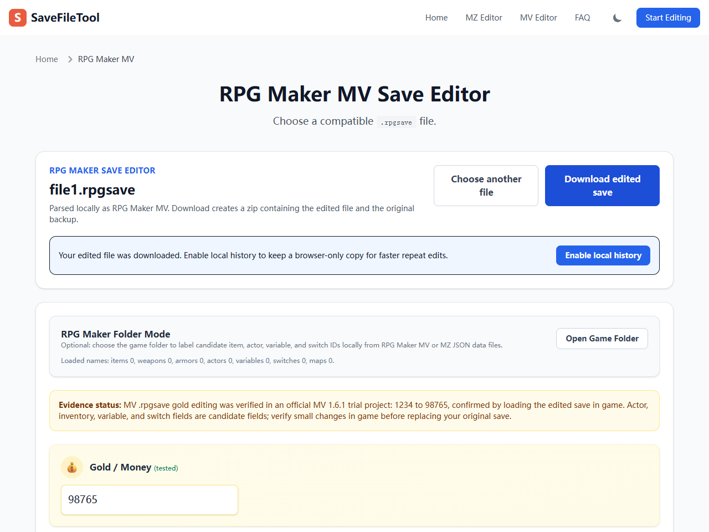

# SaveFileTool

SaveFileTool is a browser-based save editor for RPG Maker MZ `.rmmzsave` and MV `.rpgsave` files.

[Open SaveFileTool](https://savefiletool.com) | [MZ editor](https://savefiletool.com/editor/rpg-maker-mz/) | [MV editor](https://savefiletool.com/editor/rpg-maker-mv/)



The public site offers separate MZ and MV editors, each restricted to its published extension.

## Published Scope

- RPG Maker MZ: `.rmmzsave`
- RPG Maker MV: `.rpgsave`; gold editing verified in an official MV 1.6.1 trial project (1234 to 98765, loaded in game). Third-party MV games and custom plugins are not covered by that evidence.

Other RPG Maker extensions are not part of the public support promise until verified with real save files.

Files are selected and processed in the browser. Always keep the original backup before replacing a save file in game.

## Development

```bash
npm install
npm run dev
```

## Build

```bash
npm run build
```

The production build prerenders the public RPG Maker editor, FAQ, support, and legal pages.

## Indexing Helpers

```bash
npm run index:urls
```

This prints only the currently published RPG Maker-scope URLs.
